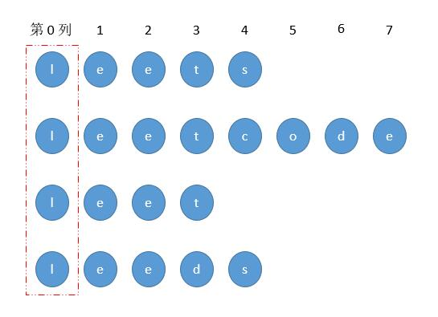

# \#14E 最长公共前缀

## 题目

编写一个函数来查找字符串数组中的最长公共前缀。

如果不存在公共前缀，返回空字符串 `""`。

**示例 1:**

```text
输入: ["flower","flow","flight"]
输出: "fl"
```

**示例 2:**

```text
输入: ["dog","racecar","car"]
输出: ""
解释: 输入不存在公共前缀。
```

**说明:**

所有输入只包含小写字母 `a-z` 。

## 解法一 列比较



把所有字符串垂直排列，然后一列一列的比较，直到某一个字符串到达结尾或者该列字符不完全相同。

```javascript
const longestCommonPrefix = function(strs) {
    let result = '';
    if (!strs.length) return result;
    for (let j=0;j<strs[0].length;j++){// 遍历列
        for (let i=1;i<strs.length;i++){// 遍历每一个
            if (strs[i][j]!=strs[0][j]) return result
        }
        result += strs[0][j];
    }
    return result;
};
```

## 解法二 两两比较

每次比较的是两个相邻字符串。以第一个字符串为初始值，一旦对应列比较不相等，更新 result 为新的最小共用 str。遍历比较结束后即可得最终结果


```javascript
var longestCommonPrefix = function(strs) {
    let result = ''
    if(!strs.length) return result
    // 以第一个字符串为基准
    result = strs[0] 
    for(let i = 0; i < strs.length; i ++){
        // 重点，保存 result 和 strs[i].length 较短那个
        const minLen = Math.min(result.length, strs[i].length)
        let j = 0
        for(j; j < minLen; j++){
            if(result[j] !== strs[i][j]){
                break
            }
        }
        // 保存当前的j strs[i] 为result的最新值
        result = strs[i].substring(0, j)
    }
    return result
}
```


